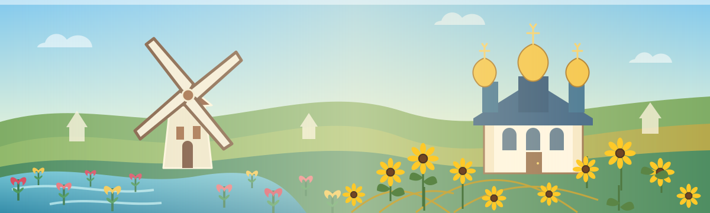
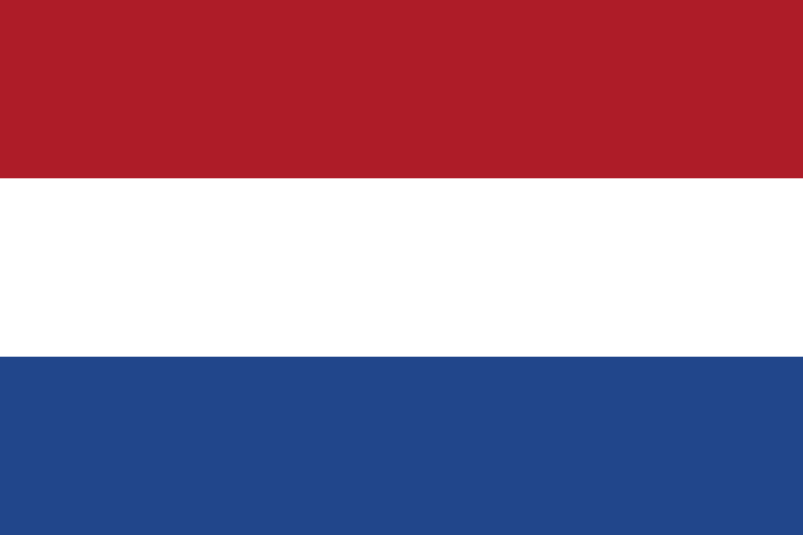
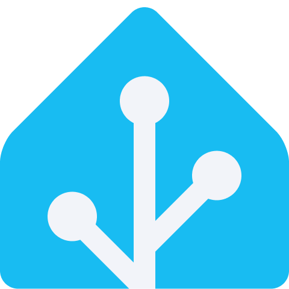

  

<h1 align="center">Hey there 👋</h1>

  I'm André, a DevOps engineer and Microsoft Azure specialist with over 20 years of IT experience and multiple Microsoft certifications. I help organizations build scalable, flexible, and secure cloud-native solutions on Azure.

  My work includes migrating on-premises environments, databases, and web servers to Azure, as well as creating reusable Bicep blueprints for consistent deployments across managed customer environments. I enjoy sharing knowledge and working as part of a team, and was recognized as a Microsoft MVP for Windows and Devices for IT.

  I also blog at <a href="https://www.thecloudadmin.eu/">TheCloudAdminEU</a> and build custom Home Assistant integrations. Based in Ermelo , Netherlands .

  
  
  

<h2 align="center">Things I work with</h2>

  
  
  
  
  
  
  

  

<h2 align="center">Home Assistant</h2>

  I build custom integrations to connect devices and services with Home Assistant.

<ul>
  <li><a href="https://github.com/aavdberg/ha-petkit"><code>ha-petkit</code></a> — Local Bluetooth support for Petkit water fountains, including BLE proxy support.</li>
  <li><a href="https://github.com/aavdberg/ha-teams"><code>ha-teams</code></a> — Microsoft Teams notifications through the Microsoft Graph API.</li>
  <li><a href="https://github.com/aavdberg/ha-dtek"><code>ha-dtek</code></a> — DTEK outage schedules, emergency shutdowns, and maintenance windows.</li>
  <li><a href="https://github.com/aavdberg/ha-mbecocoach"><code>ha-mbecocoach</code></a> — Experimental Mercedes Eco Coach integration for Home Assistant 2026.9.</li>
</ul>

  Last refreshed: Tuesday, 6 October 2026 at 02:48 CEST · Generated from <a href="./main.mustache">main.mustache</a>.

